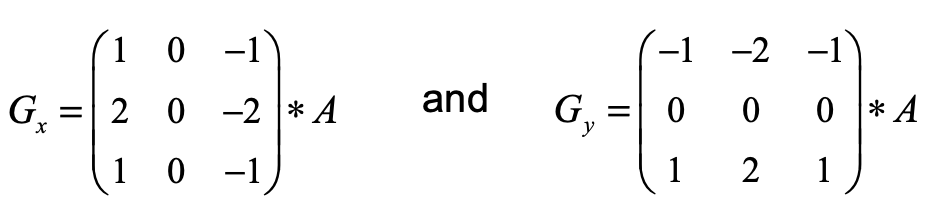

# Sobel Filter/Operator
The sobel filter uses two 3 x 3 kernels. One for changes in the horizontal direction, and one for changes in the vertical direction.

The two kernels are convolved with the original image to calculate the approximations of the derivatives.
If we define Gx and Gy as two images that contain the horizontal and vertical derivative approximations respectively, the computations are:

Where A is the original source image.

The x coordinate is defined as increasing in the right-direction and the y coordinate is defined as increasing in the down-direction.

